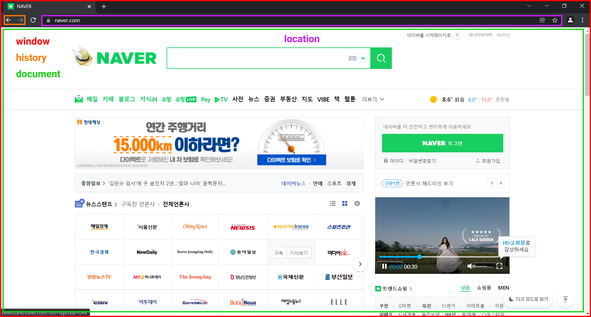

# BOM

## BOM 객체의 종류&#x20;

|   객체 종류   |           설명          |
| :-------: | :-------------------: |
|   window  |       웹 브라우저 제어       |
|   screen  |         OS 화면         |
|  location |      브라우저 주소 표시줄      |
|  history  |       사이트 방문 기록       |
| navigator |        브라우저 정보        |
|  document | 문서 객체 \<body>\</body> |
